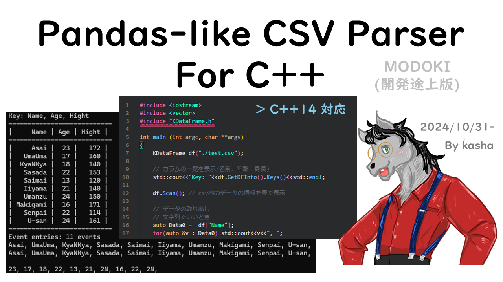
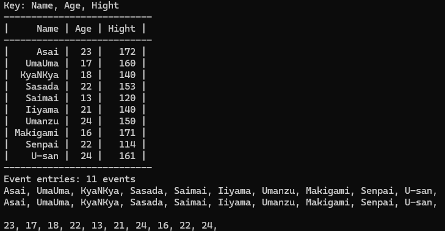

<head>
    <meta name="twitter:card" content="summary_large_image">
    <meta name="twitter:title" content="Pandas-like CSV Parser">
    <meta name="twitter:description" content="Pandas-like CSV Parser">
    <meta name="twitter:image" content="pics/header.png">
</head>

# Pandas-like CSV Parser

<p align="center">

</p>


<!--  -->

-yellow)


# C++でもpandasみたいなことがしたい

ということを目標に開発を始めたCSV Parserです.

- [Pandas-like CSV Parser](#pandas-like-csv-parser)
- [C++でもpandasみたいなことがしたい](#cでもpandasみたいなことがしたい)
- [基本情報](#基本情報)
  - [更新履歴](#更新履歴)
    - [実装予定の機能](#実装予定の機能)
    - [履歴](#履歴)
    - [更新予定の情報](#更新予定の情報)
- [使い方](#使い方)
  - [目次的なやつ](#目次的なやつ)
  - [配布物 \& ディレクトリ構造](#配布物--ディレクトリ構造)
  - [インストール](#インストール)
    - [超かんたん](#超かんたん)
    - [CMake](#cmake)
  - [サンプルプログラムの使い方](#サンプルプログラムの使い方)
  - [簡単なAPIリファレンス](#簡単なapiリファレンス)
- [生まれた経緯](#生まれた経緯)

# 基本情報

- Author: Keasha 改め K. Kotera.
- 開発開始日: 2024/10/30-.
- Version: beta 1.0.1 (2024/11/01).
- Header only?: YES. 単一Headerで配布(他のライブラリとの兼ね合いで今後変わるかもしれないけど全部Header onlyにはする).
- 動作環境
  - コンパイラ: C++14以上
  - OS: Linux(Ubuntu, CentOS)は確認済み、Windowsでもwslを使えばいける.
    - ただしLinux使用を想定してるため、改行コードが違うWindowsやMacでは動作がうまくいかないと思われ(ref: [とほほ](https://www.tohoho-web.com/wwwxx011.htm))
    - 追記: Windowsのcsvを読み込んだときにエラーを履くことに関しては修正済み。クロスプラットホームはまだ何もしてない。
    - 暇があれば対応したいわね (D論でしんでる).
- ライセンス: MIT

[**リファレンスガイドはこちら**](https://kyashaa.github.io/Pandas-like-csv-parser/)

## 更新履歴

- 0.0.0 (2024.10.31): ベータ版: 初リリース
- 0.0.1 (2024.11.01): ベータ版: バージョン情報(次項)
- 0.0.2 (2024.11.03): ベータ版: バージョン情報(次項)
- 0.1.1 (2025.08.01): アルファ版: 暫定正式版
- 0.1.2 (2025.08.01): アルファ版: 修正
- 0.1.3 (2025.12.02): アルファ版: 修正・正式版に向けての基本機能追加

### 実装予定の機能

Linux(Ubuntu)で気軽に使えるパーサーとして使えればいいという思いで開発したので、機能としては正式版として公開してもいいのだが…

この状態だと流石にtinyかも…ということで以下のどれかを実装した上でひとまず正式版として出そうと思う。

- パース機能
　- 四則演算可能にする: pandasでいう`df["val0"]+df["val1]`に似た機能
- 書き出し機能: pandasの`to_csv()`的なやつ

D論で多忙なため最適化はしてない。すまん。

### 履歴

- 0.0.3
  - windows->改行文字の違いでフォーマットが崩れる問題を修正("\n"に統一)
  - 文字列フォーマット関数の整理
    - 名前関数にまとめた
    - キャスト関数の分岐を削除: else分岐内の関数を常に定義するように変更
    - 関数を追加:改行文字の消去、空白文字等の削除等
  - 独自Vectorクラスを追加
    - 今後、pandasの`pd.Series`のような機能を追加したいため
  　- 実装後,既存の変換関数を移行する予定
　- 書き出し機能
- 0.0.2
  - インストール等のバグを修正
    - プログラム本体ではなくcmakeに関わるもの
      - それはそれで大問題だが…
    - CMakeLists.txtの処理がうまく行かなかったので修正(変数ミス)
    - installスクリプトの修正
  - `sample/test.c`を`sample/test.cpp`へ変更
    - サンプルプログラムに使用する`CMakeLists.txt`の簡便化のため
- 0.0.1
  - CMakeによるインストールに対応
  - そのためにバージョンのbが邪魔だったので暫定正式版としてリリース
  - 以降は暫定版を示す(0.x.x)としてアップデート予定
- b 1.1.0 (2024.11.03):
  - C++14対応(修正).
  - ドキュメントを追加.
- b 1.0.1 (2024.11.01):
  - ドキュメントの修正: ~~C++14対応~~ →C++17以降対応, 記述内容を修正.
  - コードの方もC++14以降に対応できるように修正中.
- b 1.0.0 (2024/10/31):初リリース

### 更新予定の情報

- 書き込みへの対応(終了後正式版として公開).
- CERN ROOT-likeな書き方ができるようにも準備中.

# 使い方

## 目次的なやつ

- [チュートリアルのソースコード](https://kyasyaa.github.io/Pandas-like-csv-parser/test_8c.html)
- [メインの制御クラス(KDataFrame Class)のリファレンス](https://kyasyaa.github.io/Pandas-like-csv-parser/classKDataFrame.html)

## 配布物 & ディレクトリ構造

- **配布物**

- `KDataFrame.h`: **これが本体**.
- `test.c`: サンプルプログラム.
- `test.csv`: 適当に作ったサンプル用csvファイル.

- **ディレクトリ構造**

```bash
. # 以下の作業ではここが基準になります
├─ header
|  └─ KDataFrame.h # これがメイン
├─ pics # (関係なし)
└─ sample
   ├─ test.c # テスト用のファイル
   └─ test.csv # テスト用のcsvファイル
```

## インストール

主に2種類の方法があります。

### 超かんたん

このプログラムは**ヘッダオンリ**です。なので、

1. [次項](#サンプルプログラムの使い方)で示すように`KDataFrame.h`を使いたいプロジェクトにコピペ
2. あとは`#include "KDataFrame.h"`すれば使用可能。

### CMake

最新の暫定版(0.0.1)からはCMakeによるインスコにも対応しています。これらのライブラリは`KBA`の一種として提供されます。まず、プロジェクトをcloneします。

```bash
git clone https://github.com/kyashaa/Pandas-like-csv-parser.git
```

その後ヘッダをコピーします。

```bash
mkdir Build && cd Build
cmake ..
sudo make install
```

これを記述したbashスクリプト`install.sh`もあります。

あとはインクルードするだけ

```cpp
#include <KDataFrame.h>
```

コンパイルに使う`CMakeLists.txt`では、`find_package`が使えるようになる

```bash
find_package(KDataFrame REQUIRED)

target_link_libraries(${target} PUBLIC KBA::KDataFrame)
```

ただし、`target`はターゲットのファイル名。

## サンプルプログラムの使い方

サンプルプログラムを動かすには**配布物をすべて同じディレクトリに配置**してください。(メインのヘッダファイルはサンプルと混ざって理由がわからなくならないように配布時にはわざと分けています)
なので、まずカレントディレクトリ「配布物」で列挙したファイルをすべてコピーします。

```bash
cp header/KDataFrame.h .
cp sample/test* .
```

もちろん自分で`test.c`を書いてくれてもおｋ (関数の説明も兼ねて[次節](#簡単なapiリファレンス)で解説).とりまここまですればこうなってるはず

```bash
. 
├─ KDataFrame.h # コピーしたやつ
├─ test.c # コピーしたやつ
├─ test.csv # コピーしたやつ
├─ header
├─ pics
└─ sample
```

あとは普通にコンパイルするだけ(ヘッダオンリーだから楽だね!)

```bash
g++ test.c -o test.out
```

実行

```bash
./test.out
```

実行したら下の図の感じになっているはず。

<p align="center">

</p>

## 簡単なAPIリファレンス

`sample/test.c`にあるコードが現状できることのすべてレベル.

```c++
#include <iostream>
#include <vector>
#include "KDataFrame.h"

int main (int argc, char **argv)
{
    KDataFrame df("./test.csv");
    
    // カラムの一覧を表示(名前、年齢、身長)
    std::cout<<"Key: "<<df.GetDFInfo().Keys()<<std::endl; 

    df.Scan(); // csv内のデータの情報を表で表示

    // データの取り出し
    // 文字列でいいとき
    auto Data0 =  df["Name"];
    for(auto &v : Data0) std::cout<<v<<", ";
    std::cout<<"\n";
    
    // 上と同じ意味
    // df["Name"] <=> df.GetcolumnStr("Name")
    auto Data1 = df.GetcolumnStr("Name");
    for(auto &v : Data1) std::cout<<v<<", ";
    std::cout<<"\n";

    std::cout<<"\n";

    // 数字として取り出したい(文字列をキャストして取り出したい)とき
    auto Data = df.Get<int>("Age");
    for(auto &v : Data) std::cout<<v<<", ";
    std::cout<<"\n";

    return 0;
}
```

解説としては以下の通り.

- ローカルに置いて使っているので`#include`は二重引用符("").
- `KDataFrame df("./test.csv")`: constructor. 読み込みたいファイル名を指定.
- `df.GetDFInfo().Keys()`: キーを取得.
  - `df.GetDFInfo()`: CSVの情報を取得している.
- `df.Scan()`: csvの内容を表形式で表示. **NOTE: 長すぎるとカットされる.**
- データの取得:
  - 文字列でいいとき(後で整数なり少数なりに変換するとき):
    - `df["カラム名"]`で取得できる. これは`df.GetcolumnStr("カラム名")`と同じ.
  - 数字などの別の型で取り出したいとき:
    - `df.Get<型>("カラム名")`
    - テスト段階であることもあって`int`, `double`のみ対応. これから増やしていく.

[**リファレンスガイドはこちら**](https://kyasyaa.github.io/Pandas-like-csv-parser/)

# 生まれた経緯

上に書いてあることがすべてみたいなところがあるが…
数年前、別のCSV Parserを作って使っていたのだけど、それを改造中に本業が忙しくなり放置してたら壊れちゃった…しかも数千行くらいあるからなにがなんだかわからん!
ので一年くらい毎回毎回CSVのプログラムを書いていたのだけど、C++でCSVのプログラムを書いているとカラムが増えたときの対応が大変！例えば…

"Age"という名前のカラムは読み出したデータの配列のx番目だから配列(vector)のx番目を指定して…

っていうのを何度も考えないといけない。クソめんどい。Pythonの[pandas](https://pandas.pydata.org/)モジュールなら

```
df["Age"]
```

だけで全部のデータを一気に取ってこれる！。これがほしい。というか昔作ってたのはそれができたし、何なら書き出しもできた…
ということで「せめて読み出しだけはできるようにしよう…そのほうが結局時短になるわ…」ということで再開発を始めることに…

研究で使う環境がC++14以上なのでそれに対応できるように作っていきたい(と言いながら初日からミスが発覚したので別の方法を考え中だが…).

最終的には読み書きができることを目標です.
